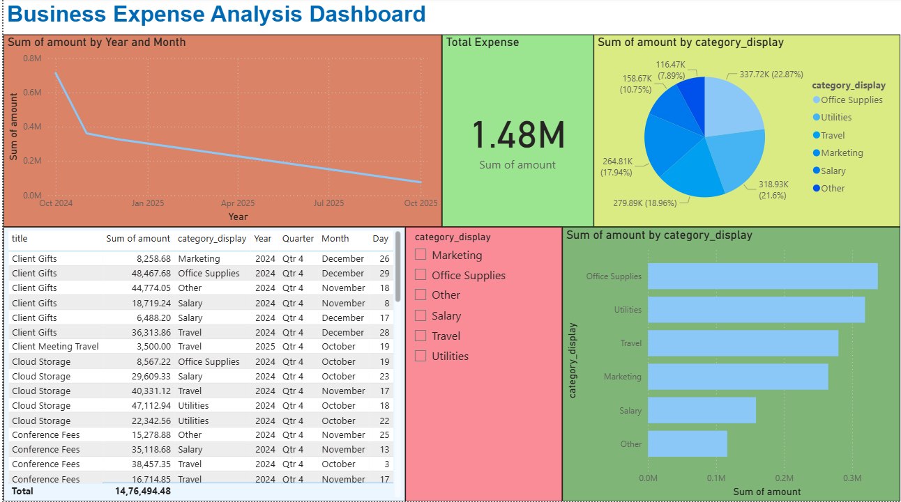

# Business Process Automation Dashboard

## Project Overview
A full-stack web application designed to automate and streamline core business operations including expense tracking, invoice generation, and financial reporting for small enterprises. The system integrates SQL-based workflows for real-time data updates and report generation, minimizing manual data entry errors.

## Features
- **Expense Management**: Track and categorize business expenses with bulk CSV import
- **Invoice Generation**: Create and manage client invoices with multiple status tracking
- **Financial Reports**: Visual analytics with charts and category breakdowns using Chart.js
- **Role-Based Access Control**: Admin and Employee roles with different permissions
- **Data Export**: Export expenses and invoices to CSV format
- **User Profiles**: Manage user information, departments, and contact details
- **Power BI Integration**: REST API endpoints for real-time business intelligence dashboards
- **Real-time Dashboard**: Overview of financial metrics and recent activities
- **Bulk Import**: Upload multiple expenses/invoices at once via CSV files

## Prerequisites
- Python 3.10 or higher
- pip (Python package manager)
- Git
- Power BI Desktop (optional, for dashboard viewing)

## Installation & Setup

### Step 1: Clone the Repository
```bash
git clone https://github.com/YOUR-USERNAME/business-automation-dashboard.git
cd business-automation-dashboard
```

### Step 2: Create Virtual Environment
```bash
python -m venv venv

# Windows
venv\Scripts\activate
```

### Step 3: Install Dependencies
```bash
pip install -r requirements.txt
```

### Step 4: Database Setup
```bash
python manage.py migrate
```

### Step 5: Create Superuser (Admin Account)
```bash
python manage.py createsuperuser
```
Follow the prompts to create your admin username and password.

### Step 6: Run Development Server
```bash
python manage.py runserver
```
## Project Structure
```
business_automation_dashboard/
├── business_automation/        # Project settings
│   ├── settings.py            # Configuration
│   ├── urls.py                # Main URL routing
│   └── wsgi.py                # WSGI configuration
├── dashboard/                  # Main application
│   ├── migrations/            # Database migrations
│   ├── templates/             # HTML templates
│   │   └── dashboard/
│   ├── models.py              # Database models
│   ├── views.py               # Business logic
│   ├── urls.py                # App URL routing
│   ├── admin.py               # Admin configuration
│   └── serializers.py         # API serializers
├── screenshots/               # Dashboard screenshots
├── manage.py                  # Django management script
├── requirements.txt           # Python dependencies
├── .gitignore                # Git ignore rules
├── README.md                 # This file
└── db.sqlite3                # SQLite database
```
### Main Dashboard


## Key Features Explained

### 1. Dashboard Home
- Real-time statistics: Total expenses, monthly expenses, invoice counts
- Recent transactions display (last 5 expenses and invoices)
- Quick navigation to all modules
- User-specific data isolation

### 2. Expense Management
- Add individual expenses with detailed information
- Bulk import from CSV files (upload 100+ expenses at once)
- Category-based organization
- Date tracking and filtering
- Export to CSV for external analysis
- Total expense calculation

### 3. Invoice Management
- Generate invoices with unique numbers
- Client information tracking (name, email)
- Status management workflow (Draft → Sent → Paid)
- Due date tracking for payment reminders
- Bulk import from CSV files
- Export functionality

### 4. Financial Reports
- Expenses breakdown by category (pie chart)
- Invoice status distribution
- 6-month trend visualization using Chart.js
- Interactive line charts comparing expenses vs invoices
- Real-time calculations

### 5. Power BI Integration
REST API endpoints for connecting to Power BI:
- `/dashboard/api/expenses/` - All expense data
- `/dashboard/api/invoices/` - All invoice data
- `/dashboard/api/summary/` - Dashboard summary statistics

### 6. Bulk Import Feature
- Upload CSV files with multiple records
- Automatic validation and error reporting
- Template format provided in the interface
- Success/error count after import

## Power BI Integration

1. **Create Visualizations**
   - **Pie Chart**: Expenses by `category_display`
   - **Line Chart**: `amount` by `date`
   - **Card Visual**: Sum of `amount`
   - **Table**: All fields for detailed view
   - **Bar Chart**: Compare categories

2. **Refresh Data**
   - Add/modify data in Django dashboard
   - Click "Refresh" button in Power BI
   - Visualizations update automatically

### Note
- Django server must be running for Power BI to fetch data
- Use manual refresh in Power BI Desktop
- For automatic refresh, publish to Power BI Service with scheduled refresh
